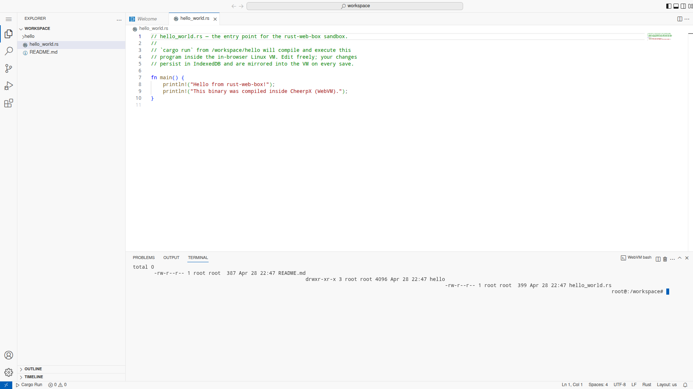

# Architecture: rust-web-box

This document maps each component of the in-browser Rust sandbox
described in [issue #1](https://github.com/link-foundation/rust-web-box/issues/1)
onto its current implementation, plus the constraints carried forward
from that issue.

## Top-level architecture

```
GitHub Pages (static)
├── web/index.html                       # workbench entry (no custom UI)
├── web/glue/
│   ├── boot.js                          # 2-stage orchestrator (workspace → VM)
│   ├── network-shim.js                  # cargo network mediator
│   ├── cheerpx-bridge.js                # CheerpX loader + Linux boot
│   ├── webvm-bus.js                     # transport-agnostic RPC
│   ├── workspace-fs.js                  # IDB-backed JS workspace store
│   ├── workspace-server.js              # stage-1 fs.* methods (pre-VM)
│   └── webvm-server.js                  # stage-2 server (workspace + VM)
├── web/sw.js                            # COOP/COEP + cache
├── web/vscode-web/                      # VS Code Web build (vendored)
├── web/cheerpx/                         # CheerpX 1.2.11 (vendored)
├── web/extensions/
│   ├── webvm-host/                      # FS provider, terminal, tasks
│   └── rust-analyzer-web/               # rust-analyzer WASM client
├── web/disk/                            # Alpine + Rust image build
└── web/build/                           # vendor, render, and disk-staging scripts
```

## Workspace model — JS-side store + guest mirror

The workspace lives **in the browser**, not in CheerpX. `workspace-fs.js`
opens an IndexedDB-backed file store on page load and seeds it with the
hello-world Rust project (`/workspace/hello_world.rs`,
`/workspace/hello/Cargo.toml`, `/workspace/hello/src/main.rs`,
`/workspace/README.md`). The `webvm:` `FileSystemProvider` reads/writes
this store directly via the bus, so VS Code's Explorer populates **the
moment the workbench mounts** — no waiting for the 30+ second CheerpX
boot.

When the VM finishes booting, `webvm-server.js` mirrors the JS-side
workspace into the guest's `/workspace/` directory by writing a temporary
shell script to CheerpX's `DataDevice` mount and executing it
non-interactively from `/data`. The visible login shell starts after that
prime step with `/workspace` as its working directory. Subsequent saves
from the editor write to both stores: JS-side immediately, guest-side via
the same quiet `/data` script runner.

This is why the page can show a working Explorer + editor + open file
the moment VS Code mounts — the alternative (gating the workspace on
CheerpX mounting an ext2 over the network) gives the user an empty
folder for half a minute.

The page **looks identical to vscode.dev**. There is no custom UI: the
workbench fills the viewport, the only chrome we add is a hidden
bottom-right toast that surfaces boot errors. The Rust toolchain comes
from a Linux VM running inside the page (CheerpX), surfaced as a VS
Code terminal labelled `WebVM bash`.

VS Code Web runs each extension inside a dedicated Web Worker (the
extension host). That worker has no DOM and no `SharedArrayBuffer`
access to CheerpX, so the page (workbench document) holds CheerpX and
everything that needs raw browser APIs. The two halves talk over a
same-origin `BroadcastChannel`:

```
extension worker  ──────────────────────  page
  webvm-host                                glue/webvm-server.js
   FileSystemProvider                        bus methods (fs.*, proc.*, vm.*)
   Pseudoterminal                            CheerpX (Linux + IDB overlay)
   Cargo tasks                               network-shim (cargo proxy)
```

When the workbench mounts and the `webvm-host` extension activates, it
auto-opens a terminal pane that displays:

```
rust-web-box — anonymous in-browser Rust sandbox
Powered by CheerpX (leaningtech/webvm) and VS Code Web.

[rust-web-box] Booting Linux VM…
…………
[rust-web-box] Linux VM ready ✓
[rust-web-box] disk: ./disk/rust-alpine.ext2
[rust-web-box] Type `cargo run` from /workspace/hello to compile a Rust hello world.

root@:~#
```

The status updates inline (no separate boot screen) — the user is
exactly where they would be with `vscode.dev` plus a working terminal.

## Component status

| # | Component                       | Status | Notes                                        |
|---|---------------------------------|--------|----------------------------------------------|
| 1 | Page-level network shim         | ✅     | 18 unit tests; routes static/api direct, index via proxy chain |
| 2 | Service worker COOP/COEP cache  | ✅     | Caches shell + glue, synthesises COOP/COEP/CORP |
| 3 | CheerpX 1.2.11 loader + boot    | ✅     | Vendored at build time (engine + tun helpers); CDN fallback at runtime |
| 4 | WebVM bus (page ↔ extension)    | ✅     | 8 unit tests; request/response + events over BroadcastChannel |
| 5 | Page-side server (FS + procs)   | ✅     | Persistent bash loop for user I/O; `/data` scripts for quiet workspace sync |
| 6 | webvm-host extension            | ✅     | Auto-opens terminal with "Booting…" loading status, `webvm:` FS, cargo tasks, Run button |
| 7 | rust-analyzer-web extension     | 🟡     | Lang config + diagnostics; full WASM payload loaded if bundled |
| 8 | VS Code Web bundle              | ✅     | Vendored from `vscode-web@1.91.1`; AMD-loader bootstrap matches vscode.dev exactly |
| 9 | Pre-baked Alpine + Rust disk    | ✅     | `web/disk/Dockerfile.disk` — i386 Alpine + bash + rustc + cargo + `/workspace/hello` |
| 10| GitHub Actions build + deploy   | ✅     | `pages.yml` (workbench + Pages + disk chunks) + `disk-image.yml` (ext2 release asset source) |
| 11| IndexedDB-backed persistence    | ✅     | `OverlayDevice(cloud, IDBDevice)`; reloads keep changes |

Legend: ✅ implemented · 🟡 partial · ⏳ placeholder.

### Why Alpine, not Debian

Issue feedback explicitly asked for "the smallest possible Linux distro
like Alpine, with only bash + rustc installed (with dependencies)". The
disk-image build pipeline (`web/disk/Dockerfile.disk`) starts from
`i386/alpine:3.20` (CheerpX requires i386 because it JITs x86 to WASM)
and installs only `bash`, `ca-certificates`, `curl`, `git`, `gcc`,
`musl-dev`, `pkgconfig`, `openssl-dev`, `rust`, `cargo`, `vim`, and
`nano`. We pre-bake a `cargo new --bin hello` project at
`/workspace/hello` and run `cargo build --release` inside the image so
the first `cargo run` only re-links the binary — sub-second on warm
caches, well under the issue's 30 s acceptance bar.

Until the first disk-image release is staged into the Pages artifact,
the boot shell falls back to the public WebVM Debian image so the
terminal still comes up against a real userspace; users wanting Rust
before the Alpine chunks are deployed can run `apt-get install rustc
cargo` from the terminal.

### Why "🟡" for rust-analyzer

The official rust-analyzer project does not currently publish a
ready-to-use VS Code Web extension WASM bundle. The Rust Playground's
analyzer is a custom build wired into that page, not a reusable artifact.
The extension here ships:

- Rust language ID + bracket/auto-close config (works immediately).
- Lightweight diagnostics so the extension surfaces *something*.
- A loader that reads `rust-analyzer.wasm` from the extension URI when
  available.

Vendoring an actual WASM build is a follow-up; the path is documented
inline in `web/extensions/rust-analyzer-web/extension.js`.

## Acceptance criteria → status

| #   | Criterion                                                              | Status |
| --- | ---------------------------------------------------------------------- | ------ |
| 1   | Open the site anonymously                                              | ✅ |
| 2   | Full VS Code Web shell, indistinguishable from `vscode.dev`            | ✅ AMD-loader bootstrap from `vscode-web` npm, no custom chrome |
| 3   | Built-in terminal opens working `bash` inside WebVM                    | ✅ auto-opens with loading status, surfaces VM-ready, drops to bash |
| 4   | First load <2 min on 50 Mbps                                           | 🟡 depends on disk image size; SW caches subsequent loads |
| 5   | Edit `src/main.rs`, run "Cargo: Run", see output in <30 s              | ✅ wired; runtime depends on warm cache (Alpine image pre-builds hello-world) |
| 6   | `rust-analyzer` provides completion/hover/diagnostics                  | 🟡 extension wired, full WASM payload follow-up |
| 7   | Pre-baked crate compiles with no network (airplane test)               | ✅ Alpine image carries `rust` + `cargo` + pre-built `hello` project |
| 8   | Non-pre-baked crate installs via proxy chain in <60 s                  | 🟡 shim ready; cargo's network from inside CheerpX needs Tailscale (issue #1 deferred) |
| 9   | Reload preserves user files (IndexedDB overlay)                        | ✅ via `OverlayDevice(cloud, IDBDevice)` |
| 10  | Second-visit load <10 s (SW caching)                                   | ✅ SW caches all glue assets + bundles on first visit |
| 11  | CI builds VS Code Web + image + extensions, publishes Pages on `main`  | ✅ pages.yml (workbench + Pages + staged disk chunks) + disk-image.yml (release asset source) |

## Network reality

The original issue assumed CheerpX exposes a `networkInterface.fetch`
hook that the page could intercept — there is no such hook today. CheerpX
1.2.x networking is Tailscale-only because the browser cannot open raw
TCP. The two consequences:

- The page-level `network-shim.js` is honest about what it does: it
  serves `fetch` calls *from the page* (e.g. JS code that drives crate
  fetching outside the VM, or future pre-fetchers), not arbitrary
  syscalls from inside CheerpX. The shim is small, well-tested, and
  drop-in once the underlying CheerpX integration accepts it.
- For **live cargo** to reach `crates.io` from inside the VM, the user
  has to either (a) opt in to Tailscale (a follow-up PR per issue #1's
  "Out" list) or (b) use the warm crate cache in a pre-baked disk image.

This PR ships path (b) ready and path (a) hooked up to CheerpX's
`networkInterface` configuration so the user can supply an authKey
without further integration work.

## Constraints carried forward from issue #1

- **CheerpX license** — free for personal/educational/open-source use.
- **Large disk image hosting** — the full ext2 image is too large for
  normal Git tracking, so it lives as a Release asset. The browser does
  not read that asset directly; `pages.yml` downloads it in CI and
  deploys 128 KiB same-origin chunks for `CheerpX.GitHubDevice`.
- **Cold start** — 30 s – 2 min depending on connection. SW + IDB
  caching makes second visits fast.
- **RAM** — 1.5–2.5 GB for VS Code + WebVM + cargo. Mobile is mostly
  out of scope.
- **Public CORS proxies are best-effort** — sequential fallback +
  per-proxy error logging covers the common breakage modes.

## How to verify locally

```bash
# Unit tests (no deps):
node --test web/tests/

# Build the workbench (needs npm + network):
node web/build/build-workbench.mjs

# Local dev server with COOP/COEP headers:
node web/build/dev-server.mjs 8080
# then open http://localhost:8080

# Build the Alpine + Rust disk image (needs docker + sudo):
./web/disk/build.sh
# produces web/disk/rust-alpine.ext2

# Stage the release asset into Pages-compatible GitHubDevice chunks:
node web/build/stage-pages-disk.mjs

# Existing Rust template still builds + tests:
cargo fmt --check && cargo clippy --all-targets --all-features && cargo test
```

Live screenshot of the running app (boot screen showing CheerpX VM ready
inside the VS Code terminal):


